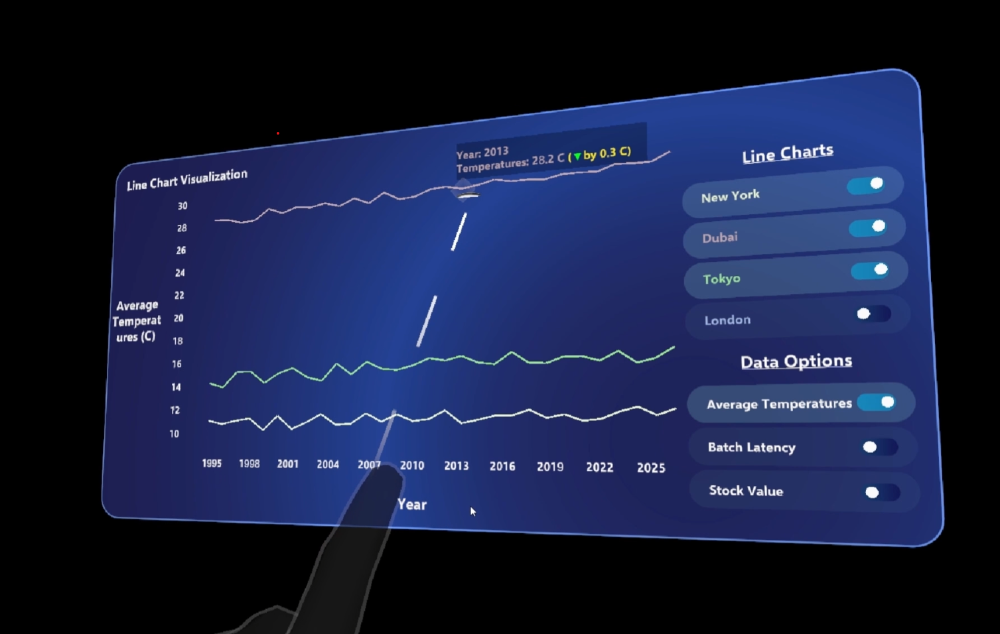

# 📊 Interactive Data Visualization in VR (Unity + MRTK3)

This Unity project enables **interactive, immersive data visualizations in Virtual Reality**, currently developed for **Microsoft HoloLens2** using **MRTK3**. It dynamically visualizes datasets from **CSV files** as **line charts**, with interactive elements designed for VR interactions like **poke** and **far ray selection**.

---

## 🚀 Features

- ✅ **Fully Interactive Line Charts in VR**
- 🔁 **Dynamic Chart Generation** from CSV datasets
- 🎛️ **Dataset Selection UI** via interactable toggles (radio-style)
- 📉 **Per-Series Toggle Controls** for showing/hiding individual charts
- ℹ️ **Point-Level Metadata Display** on hover
- 🧠 **XR Input-Ready** with support for near-poke and far-ray interactions
- 🏗️ **Built using Unity + MRTK3 + XR Interaction Toolkit**

---

## 🎥 Demo Video

[](https://drive.google.com/file/d/12Di_z-EwYQBo7gqTs01DlsUGPUS5d-u0/view?usp=sharing)

> 📌 Click the thumbnail above to watch a full walkthrough of the interactive line chart visualization in VR.


## 🧠 How It Works

### ✅ Data Pipeline

- **CSV Files** in the `Assets/StreamingAssets` folder define datasets:
  - **First column** = X-axis (e.g., Day, Year, Epoch)
  - **Remaining columns** = Y-axis (e.g., Model Accuracy, Stock values, Temperatures)

- `CSVDataLoader.cs` loads all CSV files on startup.

- `LineChartVisualization.cs` dynamically:
  - Generates line charts
  - Creates axis labels and separators
  - Builds a dataset selection panel (radio-toggle group)
  - Builds per-series toggle controls to select the preferred line charts for comparison
  - Generates interactable data points for the graph `StatefulInteractable`
  - Displays metadata on hover (X, Y, and optionally derived info like % change)

### 🔄 Interactions

- **Dataset Toggles**  
  Act as radio buttons — only one dataset is shown at a time.

- **Line Chart Toggles**  
  Enable or disable individual lines within the selected dataset for comparison.

- **Data Points**  
  Hovering over a point displays a metadata panel showing relevant information (e.g., X and Y values, percentage or absolute change).


---


## 🔧 Getting Started

### 1. Clone the Repo

```bash
git clone https://github.com/your-username/VR-Interactive-Chart.git
```

### Open in Unity

- **Unity Version**: `2022.x` or later

- **Required Packages**:
  - [Mixed Reality Toolkit 3 (MRTK3)](https://learn.microsoft.com/en-us/windows/mixed-reality/mrtk-unity/mrtk3-overview/)
  - XR Interaction Toolkit (via Unity Package Manager)


### 3. Add Your Data

- Place your CSV files inside the `Assets/StreamingAssets/` directory.

- Use the following format:

```bash
Day,CompanyA,CompanyB,CompanyC
1,100,200,150
2,105,198,160
```

- Each file represents **one dataset**:
  - The **first column** is used as the **X-axis** (e.g., Day, Year, Time).
  - Each **subsequent column** becomes a separate **line in the chart**.

---

## 🧭 Roadmap

- 📊 Bar Charts and Pie Charts with similar interaction patterns
- 🌐 Meta Quest compatibility (via OpenXR)
- 🎚️ In-VR filters and legend interaction
- 🖱️ Zoom, Pan, and Point Snapping
